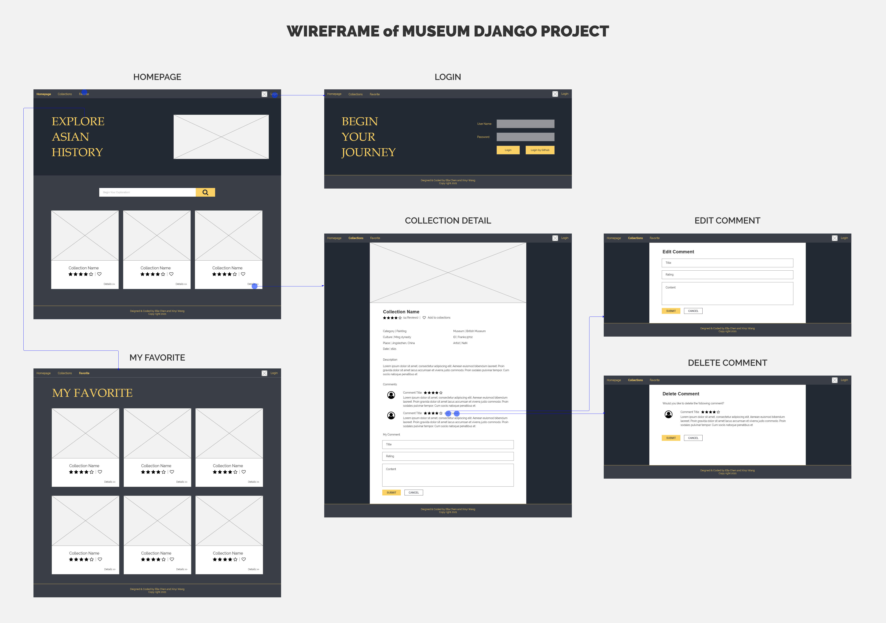
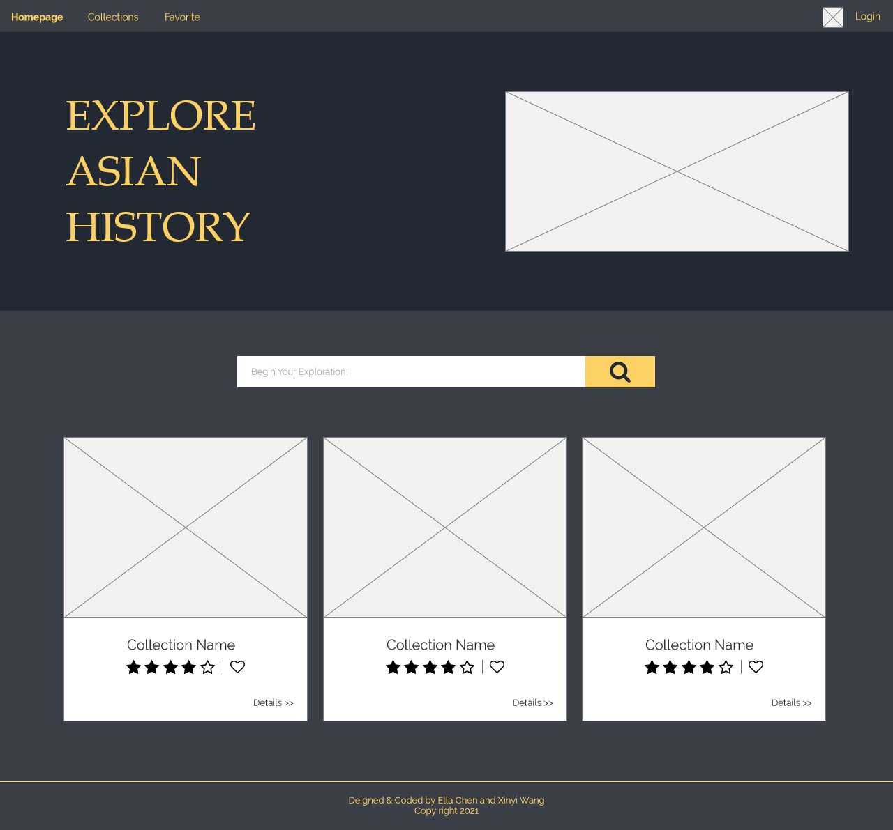
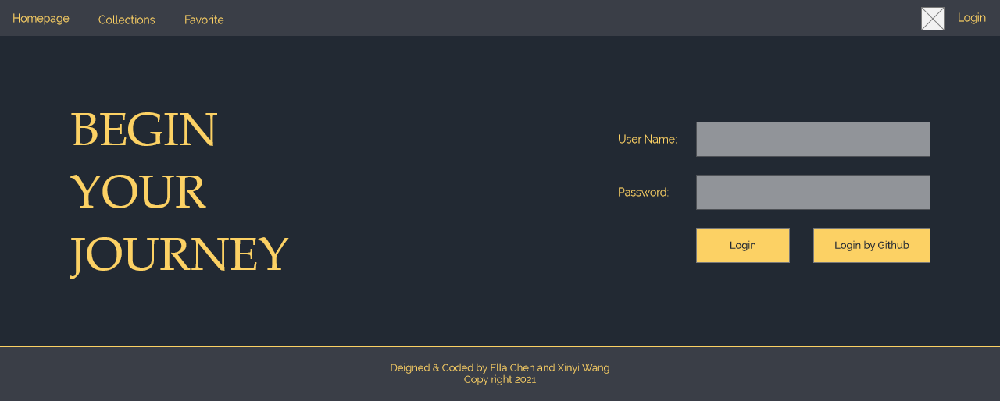
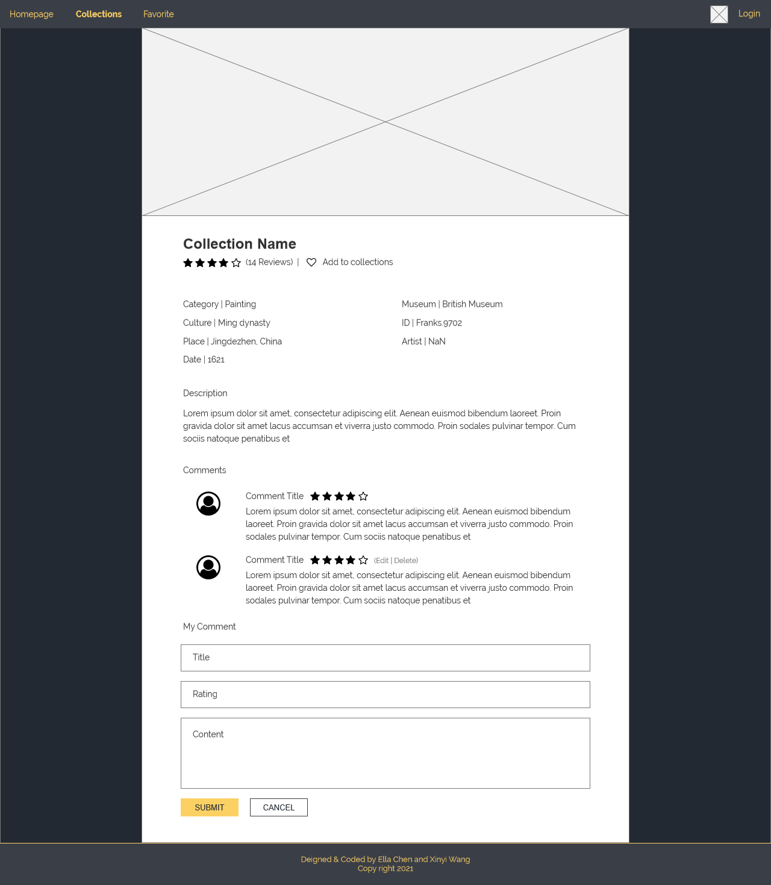
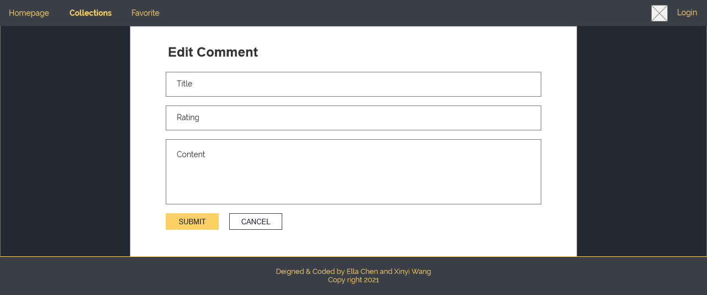
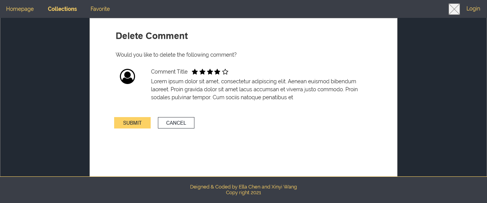
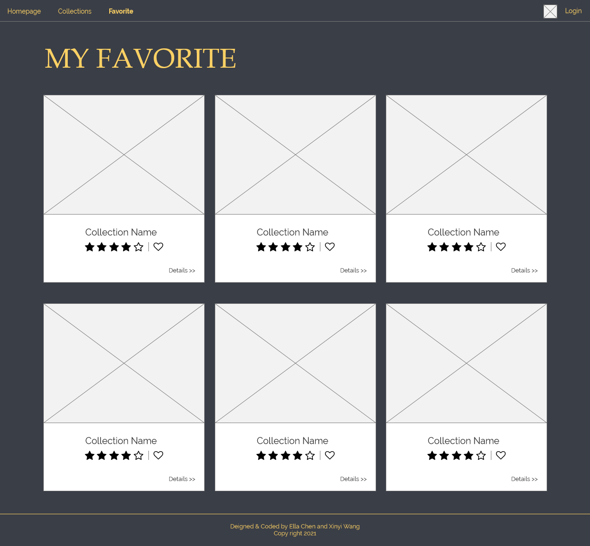

# Museum_Django_Web Milestone 3

Many museums have established their museum databases, hold digital exhibitions, and provided virtual visit services to internet tourists. However, despite the museums’ great efforts, the benefits of these services do not reach everyone. I would like to build a museum-related website based on various museum data sets that provides users a quick search on Eastern Asian Culture. 

## Databases
Followings are the database that I would like to utilize (their websites can also be referred as similar websites):
1. The Metropolitan Museum of Art, Washington, D.C., United States 
    - Website: https://www.metmuseum.org/art/collection/search
    - API: https://metmuseum.github.io/
2. Brooklyn Museum, New York, United States
    - Website: https://www.brooklynmuseum.org/
    - API: https://www.brooklynmuseum.org/api/v2/ S

## Data Structure
Followings are the data that the collection related dataset would like to store.
| Field       | Type   | Notes                                                                                                                       |
|-------------|--------|-----------------------------------------------------------------------------------------------------------------------------|
| ID          | int    | Identification number for each object                                                                                       |
| Title       | string | The title of the collection                                                                                                 |
| Image       | string | URL to the image of each object                                                                                             |
| Artist      | string | Information about the artist(s) of each object                                                                              |
| Culture     | string | Information about the culture which an object was created                                                                   |
| Country     | string | China, Japan, Mongolia or Korea                                                                                             |
| Category    | string | The classification of the object                                                                                            |
| Date        | string | Year, a span of years, or a phrase that describes the specific or approximate date when an artwork was designed or created  |
| Museum      | string | Information about belongings of each artwork                                                                                |
| Description | string | The detailed introduction of the object                                                                                     |

In detail, there will be six table: Collection(id, title, date, image, description), Museum(id, name), Country(id, name), Category(id, name), Artist(id, name), User(id, nickname, comments, rating, collection)

## User Interaction
I would like to let users use manually created accounts or use a Google social login. In the website they can make comments, collect and rank on the collections. 

## UI Design
### overview

### Home Page

### User Login Page

### Collection Detail

### Colletion Comment Edit Page

### Colletion Comment Delete Page

### Favorite Collections
